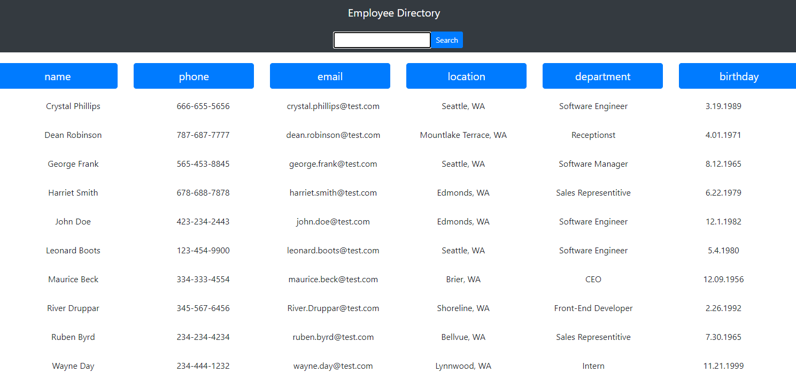

## Employee Directory

[Live DEMO](https://samisully.github.io/employeedirectory/)

## Description

A small one page react application that holds information on users that you can then filter and organize by name, birthday, location, department, email, and phone number, and also lets you search for a specific employee.

## Table Of Contents

- [Installation](#Installation)
- [Contributers](#Contributors)
- [License](#License)
- [Questions](#Questions)

## Installation

Install directly through github and run npm install. You can then deploy through heroku or github pages if you wanted a live site, or keep it on localhost.

## Contributors

Sami Sully and Georgia Tech Bootcamp Students and Staff for teaching me to write this!

(https://www.github.com/SamiSully)

HTML, CSS, BOOTSTRAP, JAVASCRIPT, REACT

## License

MIT License

(https://choosealicense.com/licenses/mit/)

Copyright © Sami Sully 2020

## Questions

If you have any questions, you can reach out to me directly at samilsuly@gmail.com
